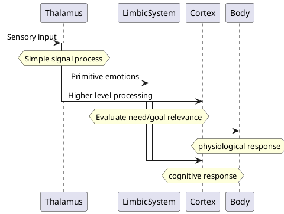

<!-- META
{"title":"Emotion in Human–Computer Interaction","link":"https://www.researchgate.net/publication/242107189_Emotion_in_Human-Computer_Interaction","media":"academic","tags":["hci","emotion","psychology","total"],"short":{"en":"total explanation of emotion in HCI","ja":"HCIにおける感情総説"},"importance":5,"hasPage":true,"createdAt":1719069210.137,"updatedAt":1719069210.137}
META -->

## Simplified LeDoux model

### Basics

## Definitions

### Emotion

- reaction to events have to do with needs/goals/concerns
- Includes physiologinal, affective, behavioral, cognitive components

### Mood

- long-term affective state
- distinguished by its **object-directedness**
- biases experienced emotion
  - has cause or contribute to moods
- **Important** to consider biasing effects while **assessing**

### Sentiment

- Assigned properties of an object
- Observed by put an object in mind the check the affective response (Clore 1994)
- can persist forever
- **Critically importance** in HCI for users to return to the product
- could be proceedingly made by prior description / stereotype

### Primitive emotions

**evolutionary** significant emotion

### Secondary emotions

knowledge-based processed emotion

- have various level
- either conscious or unconscious

### Primitive-Secondary Combined emotions

initial primitive emotion recognized/reinforced by secondary emotion

## Emotion Models

### basic emotion model

- has basic list of emotions

  - others are combinations/categorizable

- Enable...
  - emotion is distinguishable, measurable
  - emotion is universal
  - emotion is recognizable for users

### Social constructivist model

- emotion is learned
- emotion is influenced by culture
- challenging to predict
