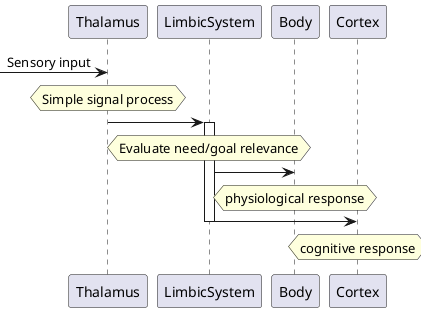

<!-- META
{"title":"Emotion in Human–Computer Interaction","link":"https://www.researchgate.net/publication/242107189_Emotion_in_Human-Computer_Interaction","media":"academic","tags":["hci","emotion","psychology","total"],"short":{"en":"total explanation of emotion in HCI","ja":"HCIにおける感情総説"},"importance":5,"hasPage":true,"createdAt":1719069210.137,"updatedAt":1719069210.137}
META -->

## Simplified LeDoux model

